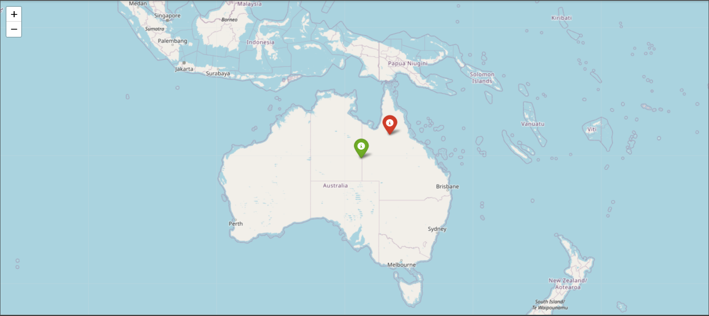

# GeoLocator
This project is an attempt to build a GeoGuessr AI that can predict the coordinates from Streetview images.

## Dataset
- Dataset used can be found here: [Streetview Image  Dataset](https://www.kaggle.com/datasets/ayuseless/streetview-image-dataset)
- The dataset has been created by combining the following datasets:
    - [Google Street View](https://www.kaggle.com/datasets/paulchambaz/google-street-view)
    - [Geotagged Streetview Images](https://www.kaggle.com/datasets/rohanmyer/geotagged-streetview-images-15k)
- There are over 25k images in the dataset.
- coordinates.csv file contains the latitude and longitude of each image. 
- The images in the dataset have size 640x640.

## Model
A pretrained Resnet18 model has been used for predicting the coordinates of the location. The fully connected layer has been modified to predict the latitude and longitude from the input image. Adam optimizer along with MSE loss has been used for optimization.

## Visualization
__Folium__ library has been used to visualize the actual and predicted coordinates for better understanding. The green marker represents the actual location whereas the red marker represents the predicted location.

